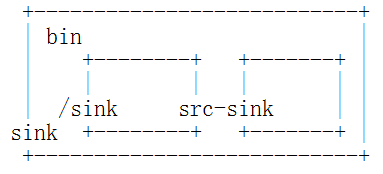

概述
****

iTVEncoder是基于gstreamer的实时编码器。

与通常的编码器不同的是，可以通过编写gstreamer插件和修改iTVEncoder配置文件的方式对编码器进行扩展定制。

要对iTVEncoder进行定制，首先需要熟悉gstreamer架构，还要熟悉gstreamer工具的使用。关于gstramer的相关内容可以访问 http://gstreamer.freedesktop.org。

要对iTVEncoder进行扩展，则需要掌握gstreamer插件编程，根据需求编写相应的插件，并编写相应的iTVEncoder配置文件来实现iTVEncoder的功能扩展。

gstreamer
=========

Gstreamer是用于流媒体应用开发的框架，Gstreamer是基于plugins的，包括Gstreamer core和若干elements，一个plugin包含一个或者多个elements。基于Gstreamer的应用程序能够具备的处理能力依赖于系统中安装的不同种类功能的elements的数量。Gstreamer核心不具备处理具体的media的功能，但是element处理media时需要具备的特性很多是由Gstreamer的核心提供的。

Gstreamer core实现了gstreamer架构，给出了数据流如何处理，规定了媒体类型的协商，注册和加载plugin，给出了编写应用的API。利用Gstreamer编写多媒体应用程序，就是利用elements构建一个pipeline。

element是pipeline的最小组成部分，element是一个对多媒体流进行处理的object，一个element对多媒体流进行的处理可能是读取文件、音频或者视频解码、音频或者视频编码、从硬件采集设备上采集数据、在硬件设备上播放多媒体、多个流的复用、多个流的解复用。

通过下图理解gstreamer框架及基于gstreamer的应用：

.. image:: _static/gstreamer-overview.png

一下分别介绍gstreamer中的基本概念，包括pipeline、bin、element、pads、caps等。

element
-------

element是pipeline的最小组成部分。element提供了多个pads，或者为sink，或者为source。一个element有四种可能的状态，分别是NULL，READY，PAUSED，PLAYING。NULL和READY状态下，element不对数据做任何处理，PLAYING状态对数据进行处理，PAUSE状态介于两者之间，对数据进行preroll。应用程序通过函数调用控制pipeline在不同状态之间进行转换。

element的状态变换不能跳过中间状态，比如不能从READY状态直接变换到PLAYING状态，必须经过中间的PAUSE状态。

element的状态转换成PAUSE会激活element的pad。首先是source pad被激活，然后是sink pad。pad被激活后会调用activate函数，有一些pad会启动一个Task。

PAUSE状态下，pipeline会进行数据的preroll，目的是为后续的PLAYING状态准备好数据，使得PLAYING启动的速度更快。一些element需接收到足够的数据才能完成向PAUSE状态的转变，sink pad只有在接收到第一个数据才能实现向PAUSE的状态转变。

bin
---

bin是由多个element构成的特殊的element，用图来说明：

pipeline是具备如下特性的特殊的bin

* 选择并管理一个全局的时钟。
* 基于选定的时钟管理running_time。running_time用于同步，指的是pipeline在PLAYING状态下花费的时间。
* 管理pipeline的延迟。
* 通过GstBus提供element与应用程序间的通讯方式。
* 管理elements的全局状态，比如EOS，Error等。

下图是一个pipeline：

.. image:: _static/pipeline.png

pads和caps
----------

pad是element与外部的接口，数据流从一个element的source pad流向另外一个element的sink pad，element能够处理的数据类型通过pad的capabilities来获得。

按照数据的流向，把pad分成source和sink两种类型。按照可用性，把pad分成Alwayse、Sometimes和Request三种类型。Alwayse类型的pad一直存在，Sometimes类型的pad在特定的情况下存在，且有可能消失，Request类型的pad在请求时才存在。典型的Sometimes类型的pad就是解复用element的source类型的pad，典型的Request类型的pad是复用element的sink类型的pad。

capbilities描述数据流的属性或者类型，capbilities附加在pad上，也就是说通过pad的数据流的类型必须是该pad允许的capabilities。

iTVEncoder
==========

.. image:: _static/itvencoderarch.png
