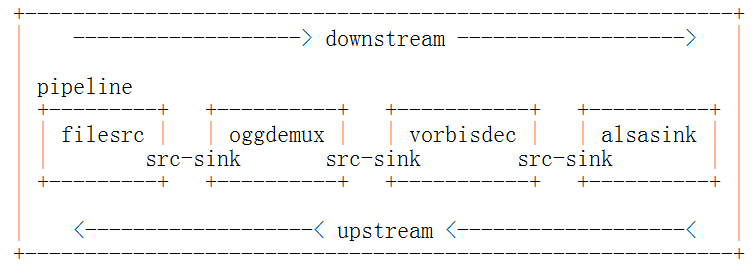
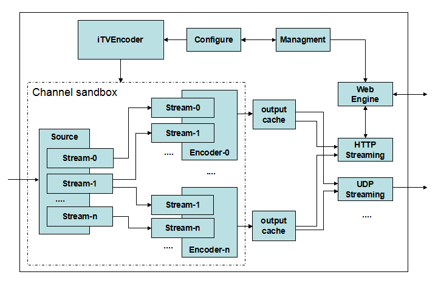

概述
****

iTVEncoder是基于gstreamer的实时编码器。

与通常的编码器不同的是，可以通过编写gstreamer插件和修改iTVEncoder配置文件的方式对编码器进行扩展定制。

要对iTVEncoder进行定制，首先需要熟悉gstreamer架构，还要熟悉gstreamer工具的使用。关于gstramer的相关内容可以访问 http://gstreamer.freedesktop.org。

要对iTVEncoder进行扩展，则需要掌握gstreamer插件编程，根据需求编写相应的插件，并编写相应的iTVEncoder配置文件来实现iTVEncoder的功能扩展。

gstreamer
=========

要了解和使用iTVEncoder，首先必须了解gstreamer。

Gstreamer是一个libraries和plugins的集合，用于帮助实现各种类型的多媒体应用程序，比如播放器，转码工具，多媒体服务器等。

利用Gstreamer编写多媒体应用程序，就是利用elements构建一个pipeline。element是一个对多媒体流进行处理的object，比如如下的处理：

* 读取文件。
* 不同格式的编解码。
* 从硬件采集设备上采集数据。
* 在硬件设备上播放多媒体。
* 多个流的复用。

elements的输入叫做sink pads，输出叫做source pads。应用程序通过pad把element连接起来构成pipeline，如下图所示，其中顺着流的方向为downstream，相反方向是upstream。

iTVEncoder
==========

